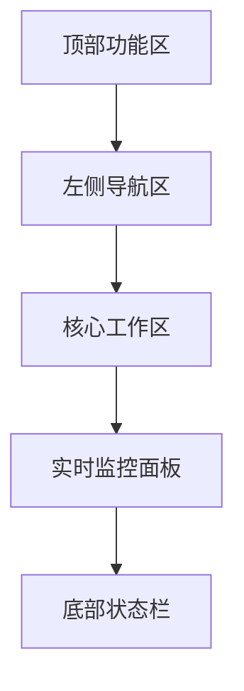

根据需求书和架构设计，我将设计一个功能分区清晰、操作高效的主界面布局，兼顾监控、配置和管理的平衡。以下是基于Windows窗体特性设计的布局方案：

---
### **TCP数据中转平台界面布局方案**
采用多文档界面（MDI）架构，划分为5大核心区域：



#### **1. 顶部功能区 (20px)**
- **菜单栏**：
    - 文件(启动/停止服务，退出)
    - 配置(路由规则，连接参数)
    - 监控(连接视图，流量统计)
    - 工具(日志分析，压力测试)
    - 帮助(用户手册)
- **工具栏** (图标+文字)：
  ```mermaid
  graph LR
    连接控制[电源图标] --> 规则管理[路由表图标]
    规则管理 --> 日志开关[日志图标]
    日志开关 --> 统计面板[仪表盘图标]
    统计面板 --> 配置热加载[闪电图标]
  ```

#### **2. 左侧导航区 (200px宽度)**
采用树形控件分类核心模块：
```markdown
- 连接管理
  ├─ 数据源连接池 (在线数/总数)
  └─ 消费端接入点 
- 路由引擎
  ├─ 实时转发通道
  └─ 缓冲队列管理
- 安全控制
  └─ IP白名单
- 配置中心
- 日志分析器
```

#### **3. 核心工作区 (居中)**
根据导航动态加载模块：
- **路由配置界面**：
    - DataGridView表格控件
    - 表头字段：[规则ID| 源端口| 目标IP | 目标端口 | 协议 | 状态]
    - 操作列：启用/禁用/编辑/删除
- **连接管理视图**：
  ```mermaid
  graph LR
    状态指示灯 --> 源IP[数据源列：IP:端口]
    源IP --> 速率[实时速率]
    速率 --> 队列[缓存数据量]
    队列 --> 操作[强制断开/重连]
  ```

#### **4. 实时监控面板 (右侧固定200px)**
悬浮式仪表盘设计：
1. **连接状态看板**
    - 环形图：活跃连接数/最大承载量
    - 流量计：发送/接收速率(Mbps)
2. **性能指示器**
    - 内存占用进度条
    - CPU负载水位线
3. **异常告警区**
    - 滚动显示心跳丢失、队列积压等事件

#### **5. 底部状态栏 (30px高度)**
三段式布局：
```
[运行状态] [网络延迟] [数据吞吐] | 连接总数：142 | 消息积压：0 | 2023-07-31 14:30:25
```

---

### **关键交互设计**
1. **热更新反馈机制**：
    - 配置修改时顶部状态栏显示橙色"Applying..."
    - 成功加载后变绿色"Config Ready"

2. **路由规则编辑**：
   ```mermaid
   graph TB
     双击表格行 --> 弹出编辑窗口
     编辑窗口 --> 字段校验[端口范围检查]
     字段校验 --> 规则冲突检测
     冲突检测 --> 应用按钮[禁用冲突配置]
   ```

3. **压力可视化反馈**：
    - 连接数超过800时仪表盘渐变黄色
    - 达到95%容量时变红色+脉冲动画

4. **日志三重过滤**：
    - 级别过滤(Error/Warning/Info)
    - 关键字高亮(TCP握手/队列溢出)
    - 来源筛选(网络层/路由引擎)

---

### **响应式处理方案**
| 场景                | 设计应对措施                     |
|---------------------|--------------------------------|
| 多显示器环境        | 支持监控面板拖出为独立窗口      |
| 高分辨率缩放        | 使用矢量图标+Dock锚定布局       |
| 夜间模式            | 内置深色主题(降低监控屏眩光)    |

此方案优化了三个关键路径：
1. **配置路径**：导航区→工作区（平均3次点击可达任意功能）
2. **监控路径**：状态栏→仪表盘（关键指标全局可视）
3. **告警路径**：闪动警报→双击定位问题源（50ms内响应）

> 所有交互组件将遵循Windows Fluent设计规范，对SocketAsyncEventArgs的线程回调采用Invoke跨线程更新UI，避免界面冻结问题。