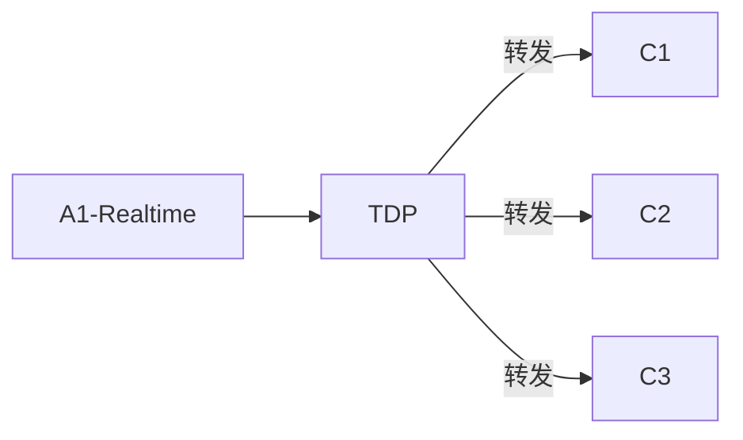
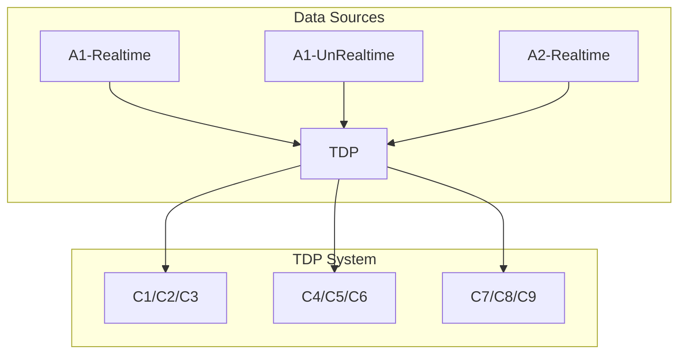

以下是根据您提供的需求撰写的**TCP数据中转平台软件产品功能需求书**，采用结构化格式呈现核心功能、系统角色和交互逻辑：

---
# TCP数据中转平台功能需求书
**版本号**：1.0  
**发布日期**：2025年7月31日

---

## 一、项目背景
为解决多数据源与数据消费端之间的异构连接问题，建立统一的TCP数据中转平台，实现：
1. 数据统一归口管理，确保数据唯一性
2. 标准化对接规范
3. 实时与非实时数据的分流处理
4. 动态路由转发能力

---

## 二、系统角色定义
| **角色**       | **职责**                          | **网络角色**    |  
|----------------|----------------------------------|---------------|  
| 数据源（A类）   | 提供实时/非实时数据               | TCP Server    |  
| 本系统（TDP）  | 数据路由中转枢纽                  | 双角色：<br> - 对数据源为Client<br> - 对消费端为Server |  
| 数据消费端（C类）| 订阅并消费数据                   | TCP Client    |  

---

## 三、核心功能需求
### 1. 连接管理模块
#### 1.1 数据源连接（Client模式）
- **功能描述**：
    - 主动连接数据源TCP Server（需配置IP/Port）
    - 支持同时连接多组数据源（如A1-Realtime/A1-UnRealtime等）
- **配置项**：
  ```yaml  
  data_sources:  
    - name: "A1-Realtime"  
      ip: 192.168.1.100  
      port: 8080  
      type: realtime  
    - name: "A1-UnRealtime"  
      ip: 192.168.1.101  
      port: 8080  
      type: unrealtime  
  ```  

#### 1.2 消费端接入（Server模式）
- **功能描述**：
    - 开放TCP服务端口供C类客户端连接
    - 支持多客户端并发接入（C1, C2, ..., Cn）
- **技术指标**：
    - 默认监听端口：9999（可配置）
    - 最大并发连接数：≥1000

---

### 2. 数据路由引擎
#### 2.1 路由规则配置
| 消费端组 | 目标数据源       | 数据类型    |  
|----------|-----------------|------------|  
| C1,C2,C3 | A1-Realtime     | realtime   |  
| C4,C5,C6 | A1-UnRealtime   | unrealtime |  
| ...      | ...             | ...        |  

#### 2.2 路由逻辑


#### 2.3 双向数据流支持
- **上行流**（消费端→数据源）：  
  `C1/C2/C3 → TDP → A1-Realtime`
- **下行流**（数据源→消费端）：  
  `A1-Realtime → TDP → C1/C2/C3`

---

### 3. 数据分类处理
| **数据类型** | **传输特性**                | **处理策略**               |  
|-------------|---------------------------|--------------------------|  
| Realtime    | 高频大数据量（毫秒级响应）   | 无缓冲直通转发             |  
| UnRealtime  | 低频传输（秒级响应）        | 可选消息队列缓冲           |  

---

### 4. 系统管理功能
#### 4.1 连接状态看板
- 实时显示：
    - 数据源连接状态（在线/离线）
    - 消费端活跃连接数
    - 实时吞吐量（MB/s）

#### 4.2 动态配置热更新
- 支持运行时修改：
    - 路由规则
    - 数据源IP/Port
    - 黑白名单控制

---

### 5. 安全控制
- **IP白名单**：
    - 数据源端：限制可连接的Server IP
    - 消费端：限制可接入的Client IP段
- **连接认证**：
    - 可选SSL/TLS加密通道
    - 支持API密钥验证（消费端连接时提交）

---

## 四、非功能性需求
| **类别**       | **要求**                      |  
|---------------|------------------------------|  
| 可靠性        | 7×24小时运行，年故障时间＜5分钟 |  
| 性能          | 实时数据延迟≤100ms（P99）      |  
| 扩展性        | 支持水平扩容，每节点处理500+连接 |  
| 日志审计      | 记录所有连接事件及消息流量统计   |  

---

## 五、系统架构示意图


---

## 六、附录：关键术语
- **Realtime**：实时数据流（如传感器实时读数）
- **UnRealtime**：非实时数据流（如历史数据补传）
- **路由规则**：消费端组与数据源的映射关系表

此文档可作为开发团队的技术输入，建议后续补充：
1. 详细API接口定义
2. 流量控制策略
3. 消息重传机制设计
4. 压力测试方案