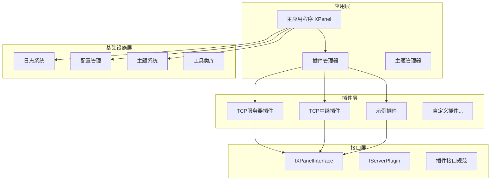
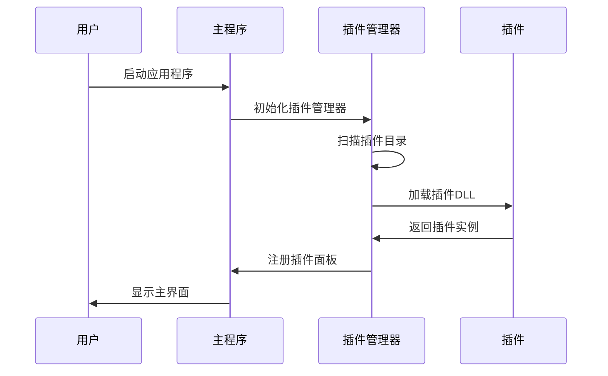
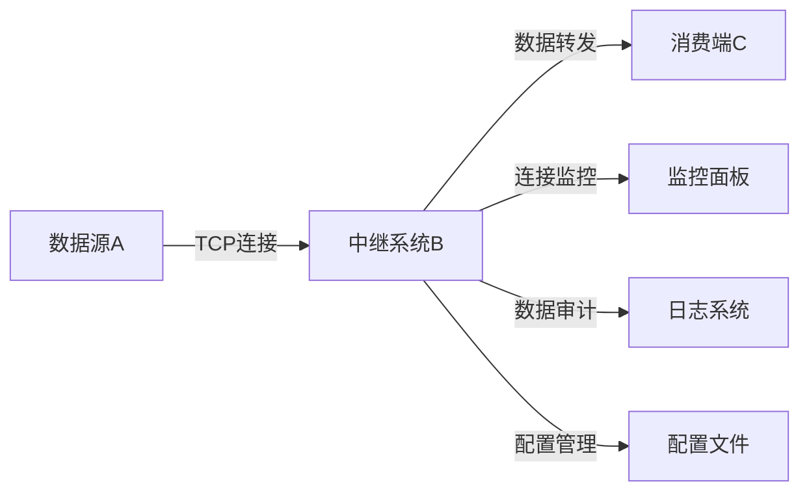
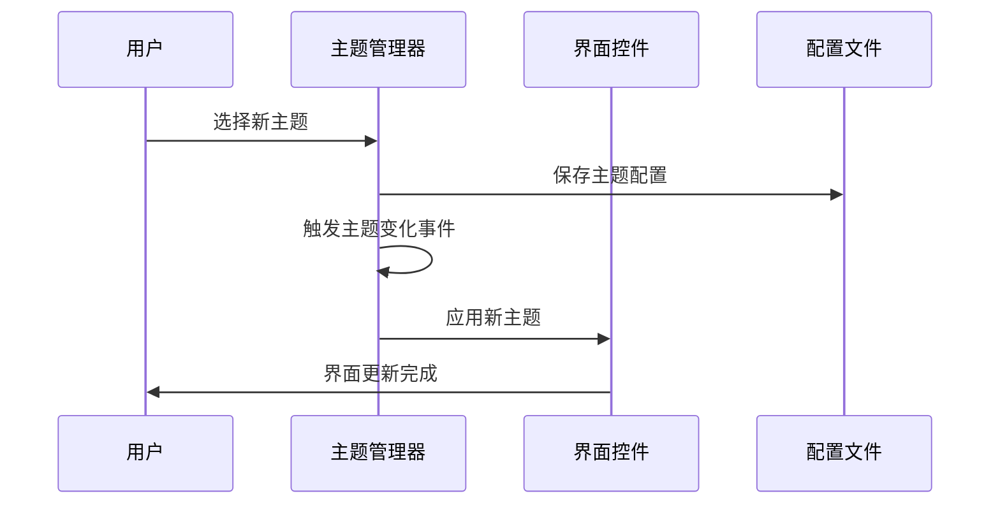

# XPanel插件化TCP数据管理平台 - 软件功能书

**版本**: 1.0.0  
**开发框架**: .NET 8.0 + WinForms  
**编写日期**: 2025年7月31日  
**项目类型**: 插件化桌面应用程序

---

## 一、项目概述

### 1.1 系统定位
XPanel是一个基于插件架构的TCP数据管理平台，提供了完整的TCP服务器管理、数据中继转发、插件管理等功能。系统采用模块化设计，支持动态插件加载，具备高度的可扩展性和灵活性。

### 1.2 技术架构


### 1.3 核心特性
- **插件化架构**: 支持动态加载/卸载插件，高度可扩展
- **TCP数据管理**: 完整的TCP服务器管理和数据中继功能
- **可视化界面**: 基于WinForms的现代化用户界面
- **主题系统**: 支持多主题切换（浅色、深色、蓝色主题）
- **实时监控**: 连接状态、数据传输、性能指标实时监控
- **配置管理**: JSON配置文件，支持热更新
- **日志系统**: 多输出源日志记录（UI、文件、控制台）

---

## 二、系统架构设计

### 2.1 项目结构
```
XPanel/
├── MainAPP/                    # 主应用程序
│   ├── Forms/                  # 窗体文件
│   │   └── MainForm.cs         # 主窗体
│   ├── Layout/                 # UI布局
│   │   └── UILayoutBuilder.cs  # 界面构建器
│   ├── Panels/                 # 内置面板
│   │   ├── PluginManagerPanel.cs  # 插件管理面板
│   │   ├── SettingsPanel.cs       # 系统设置面板
│   │   └── AboutPanel.cs          # 关于面板
│   ├── Plugins/                # 插件管理
│   │   ├── PluginLoader.cs     # 插件加载器
│   │   └── XPluginManager.cs   # 插件管理器
│   ├── Registry/               # 注册中心
│   │   └── PanelRegistry.cs    # 面板注册表
│   ├── Tabs/                   # 标签页管理
│   │   └── TabManager.cs       # 标签页管理器
│   └── Program.cs              # 程序入口
├── XPluginInterface/           # 插件接口定义
│   ├── IXPanelInterface.cs     # 面板插件接口
│   ├── IServerPlugin.cs        # 服务插件接口
│   ├── Theme/                  # 主题系统
│   │   └── ThemeManager.cs     # 主题管理器
│   └── logs/                   # 日志系统
│       └── Log.cs              # 日志工具类
├── XPluginTcpServer/           # TCP服务器插件
│   ├── Models/                 # 数据模型
│   ├── Services/               # 服务层
│   └── TcpServerPlugin.cs      # 插件主类
├── XPluginTcpRelay/            # TCP中继插件
│   ├── Models/                 # 数据模型
│   ├── Services/               # 服务层
│   ├── UI/                     # 用户界面
│   └── TcpRelayPlugin.cs       # 插件主类
├── XPluginSample/              # 示例插件
│   └── SamplePlugin.cs         # 示例实现
├── Utils/                      # 工具类库
├── Service/                    # 服务层
└── 项目文档/                   # 项目文档
```

### 2.2 核心组件说明

#### 2.2.1 主应用程序 (MainAPP)
- **MainForm**: 主窗体，提供菜单栏、标签页、状态栏
- **UILayoutBuilder**: 界面布局构建器，采用TableLayoutPanel布局
- **TabManager**: 标签页管理器，支持动态添加/关闭标签页
- **PanelRegistry**: 面板注册表，管理所有可用面板
- **XPluginManager**: 插件管理器，负责插件的加载、卸载、状态管理

#### 2.2.2 插件接口层 (XPluginInterface)
- **IXPanelInterface**: 面板插件接口，定义插件名称和面板创建方法
- **IServerPlugin**: 服务插件接口，定义服务启动、停止等方法
- **ThemeManager**: 主题管理器，支持多主题切换和配置持久化
- **Log**: 统一日志系统，支持多输出源

#### 2.2.3 TCP服务器插件 (XPluginTcpServer)
- **TcpServerConfig**: 服务器配置模型
- **ConfigManager**: 配置管理服务
- **TcpServerManager**: TCP服务器管理服务
- **TcpServerPlugin**: 插件主类，实现服务器管理界面

#### 2.2.4 TCP中继插件 (XPluginTcpRelay)
- **RouteRule**: 路由规则模型
- **TcpDataRelayManager**: TCP数据中继管理器
- **ConfigManager**: 配置管理服务
- **DataAuditor**: 数据审计服务
- **RelayControlPanel**: 中继控制面板

---

## 三、功能模块详述

### 3.1 插件管理系统

#### 3.1.1 核心功能
- **动态加载**: 支持运行时加载插件DLL文件
- **状态管理**: 插件启用/禁用状态持久化
- **依赖检查**: 插件依赖项验证
- **错误处理**: 完善的插件加载异常处理
- **热更新**: 支持插件热替换（需重启应用）

#### 3.1.2 插件规范
```csharp
// 面板插件接口
public interface IXPanelInterface
{
    string Name { get; }                    // 插件名称
    UserControl CreatePanel();             // 创建面板实例
}

// 服务插件接口  
public interface IServerPlugin
{
    string Name { get; }                    // 插件名称
    void Start();                           // 启动服务
    void Stop();                            // 停止服务
    void Start(string ip, int port, ILogOutput output);  // 带参数启动
    void InitializePorts(IEnumerable<int> ports);        // 初始化端口
}
```

#### 3.1.3 插件管理界面
- **插件列表**: 显示已安装插件的名称、状态、类型
- **操作按钮**: 安装插件、启用/禁用、卸载插件
- **实时日志**: 插件操作的详细日志输出
- **状态指示**: 插件运行状态的可视化显示

### 3.2 TCP服务器管理模块

#### 3.2.1 核心功能
- **多服务器管理**: 支持创建和管理多个TCP服务器实例
- **服务器配置**: IP地址、端口、自动启动等配置选项
- **生命周期管理**: 服务器启动、停止、重启操作
- **连接监控**: 实时监控客户端连接状态
- **配置持久化**: 服务器配置的JSON文件存储

#### 3.2.2 数据模型
```csharp
public class TcpServerConfig
{
    public string Id { get; set; }              // 服务器ID
    public string Name { get; set; }            // 服务器名称
    public string IpAddress { get; set; }       // IP地址
    public int Port { get; set; }               // 端口号
    public bool AutoStart { get; set; }         // 自动启动
    public bool IsRunning { get; set; }         // 运行状态
    public int ConnectedClients { get; set; }   // 连接数
    public string Description { get; set; }     // 描述信息
}
```

#### 3.2.3 管理界面
- **服务器列表**: DataGridView显示服务器信息
- **操作按钮**: 添加、启动、停止服务器
- **配置对话框**: 服务器参数配置界面
- **实时日志**: 服务器操作和连接日志
- **状态监控**: 定时刷新服务器状态

### 3.3 TCP数据中继模块

#### 3.3.1 系统架构
TCP数据中继系统实现A方→B方→C方的数据转发：
- **A方(数据源)**: TCP服务器，提供原始数据
- **B方(中继系统)**: 本系统，作为数据中继代理
- **C方(消费端)**: TCP客户端，接收转发数据

#### 3.3.2 核心功能
- **数据透传**: 基于异步Socket的高性能数据转发
- **路由管理**: 可配置的A→C映射规则
- **连接监控**: A方和C方连接状态实时监控
- **数据审计**: Hex+ASCII双格式报文记录
- **性能优化**: 支持200+并发连接，处理延迟≤10ms

#### 3.3.3 路由规则模型
```csharp
public class RouteRule
{
    public string Id { get; set; }                  // 规则ID
    public string Name { get; set; }                // 规则名称
    public string DataSourceIp { get; set; }        // A方IP地址
    public int DataSourcePort { get; set; }         // A方端口
    public int LocalServerPort { get; set; }        // 本地监听端口
    public int MaxConsumerConnections { get; set; } // 最大C方连接数
    public bool IsEnabled { get; set; }             // 是否启用
    public string DataType { get; set; }            // 数据类型
}
```

#### 3.3.4 控制面板设计
采用五区域分离设计：
1. **顶部控制区**: 启动/停止按钮、全局统计信息
2. **左侧规则区**: 路由规则列表和管理操作
3. **中央连接区**: A方和C方连接状态显示
4. **右侧监控区**: 实时性能指标和告警信息
5. **底部日志区**: 实时数据传输日志

---

## 四、用户界面设计

### 4.1 主界面布局
主界面采用经典的菜单+标签页+状态栏布局：
```
┌─────────────────────────────────────────────────────┐
│ 程序 | 配置 | 插件 | 关于                            │
├─────────────────────────────────────────────────────┤
│ [标签页1] [标签页2] [标签页3] ...                    │
│                                                     │
│                   内容区域                           │
│                                                     │
├─────────────────────────────────────────────────────┤
│ 状态：就绪                                           │
└─────────────────────────────────────────────────────┘
```

### 4.2 主题系统
支持三种预定义主题：
- **默认浅色主题**: 白色背景，黑色文字
- **深色主题**: 深灰背景，白色文字
- **蓝色主题**: 蓝色调背景，深蓝文字

主题配置自动保存到`Config/theme.json`文件。

### 4.3 插件管理界面
```
┌─────────────────────────────────────────────────────┐
│ 插件管理                                             │
├─────────────────────────────────────────────────────┤
│ [安装插件] [启用插件] [禁用插件] [卸载插件]           │
├─────────────────────────────────────────────────────┤
│ 插件名称    │ 文件名      │ 状态  │ 类型            │
│ TCP服务器   │ XPlugin...  │ 启用  │ 面板插件        │
│ TCP中继     │ XPlugin...  │ 启用  │ 面板插件        │
├─────────────────────────────────────────────────────┤
│ 操作日志:                                           │
│ [2025-07-31 14:30:25] [INFO] 插件加载成功           │
│ [2025-07-31 14:30:26] [INFO] 插件面板已创建         │
└─────────────────────────────────────────────────────┘
```

---

## 五、技术实现特点

### 5.1 异步编程模式
- 全面采用async/await异步编程模式
- Socket通信使用异步操作避免UI阻塞
- 定时器和事件处理的异步实现

### 5.2 线程安全设计
- 使用ConcurrentDictionary确保并发安全
- UI更新通过Invoke机制确保线程安全
- 资源访问的锁机制保护

### 5.3 资源管理
- 实现完整的IDisposable模式
- Socket连接的正确关闭和清理
- 内存泄漏防护机制

### 5.4 错误处理
- 分层异常处理机制
- 用户友好的错误提示
- 详细的错误日志记录

### 5.5 配置管理
- JSON格式配置文件
- 配置热更新支持
- 配置验证和默认值处理

---

## 六、性能指标

### 6.1 系统性能
- **并发连接**: 单实例支持200+并发TCP连接
- **数据延迟**: 报文处理延迟≤10ms（99分位值）
- **内存占用**: 基础运行内存≤50MB
- **启动时间**: 应用程序启动时间≤3秒

### 6.2 可用性指标
- **系统稳定性**: 99.9%正常运行时间
- **插件兼容性**: 支持.NET 8.0插件动态加载
- **配置恢复**: 异常情况下配置自动恢复
- **日志完整性**: 完整的操作审计日志

---

## 七、扩展开发指南

### 7.1 插件开发规范
1. **项目命名**: 插件项目以"XPlugin"开头
2. **接口实现**: 必须实现IXPanelInterface或IServerPlugin接口
3. **依赖管理**: 引用XPluginInterface项目
4. **资源清理**: 实现IDisposable接口进行资源清理

### 7.2 插件开发示例
```csharp
public class MyPlugin : IXPanelInterface
{
    public string Name => "我的插件";
    
    public UserControl CreatePanel()
    {
        return new MyPluginPanel();
    }
}

public class MyPluginPanel : UserControl
{
    public MyPluginPanel()
    {
        InitializeComponent();
        // 应用当前主题
        ThemeManager.ApplyTheme(this);
        // 监听主题变化
        ThemeManager.ThemeChanged += OnThemeChanged;
    }
    
    private void OnThemeChanged(ThemeConfig theme)
    {
        ThemeManager.ApplyTheme(this);
    }
}
```

### 7.3 主题适配
插件界面需要支持主题切换：
```csharp
// 应用主题
ThemeManager.ApplyTheme(this);

// 监听主题变化
ThemeManager.ThemeChanged += (theme) => {
    ThemeManager.ApplyTheme(this);
};
```

---

## 八、部署和使用

### 8.1 系统要求
- **操作系统**: Windows 10/11 (x64)
- **运行时**: .NET 8.0 Runtime
- **内存**: 最低2GB RAM
- **磁盘**: 最低100MB可用空间

### 8.2 安装部署
1. 下载XPanel主程序
2. 安装.NET 8.0 Runtime
3. 运行XPanel.exe启动应用
4. 通过插件管理器安装所需插件

### 8.3 配置文件
- **主题配置**: `Config/theme.json`
- **插件状态**: `Config/plugin_states.json`
- **TCP服务器配置**: `Config/tcp_server_config.json`
- **TCP中继配置**: `Config/tcp_relay_config.json`

---

## 九、版本历史

### v1.0.0 (当前版本)
- ✅ 完整的插件化架构实现
- ✅ TCP服务器管理功能
- ✅ TCP数据中继转发功能
- ✅ 主题系统和UI界面
- ✅ 插件管理和动态加载
- ✅ 配置管理和日志系统
- ✅ 完善的错误处理和资源管理

---

## 十、技术支持

### 10.1 开发团队
- **主要开发者**: Augment Agent
- **开发时间**: 2024-2025年
- **技术栈**: .NET 8.0 + WinForms + C#

### 10.2 联系方式
如需技术支持或报告问题，请通过项目文档或开发团队联系。

---

## 十一、详细技术实现

### 11.1 插件加载机制
```csharp
// 插件加载核心代码
public static List<IServerPlugin> LoadPlugins(string pluginFolder)
{
    var plugins = new List<IServerPlugin>();
    if (!Directory.Exists(pluginFolder)) return plugins;

    foreach (var file in Directory.GetFiles(pluginFolder, "*.dll"))
    {
        try
        {
            var asm = Assembly.LoadFrom(file);
            var types = asm.GetTypes().Where(t =>
                typeof(IServerPlugin).IsAssignableFrom(t) && !t.IsAbstract && t.IsClass);

            foreach (var type in types)
            {
                var instance = (IServerPlugin)Activator.CreateInstance(type)!;
                plugins.Add(instance);
            }
        }
        catch (Exception ex)
        {
            Log.Error($"加载插件失败: {file}, 原因: {ex.Message}");
        }
    }
    return plugins;
}
```

### 11.2 TCP中继核心算法
```csharp
// 数据转发核心逻辑
private async Task RelayDataAsync(Socket sourceSocket, Socket targetSocket,
    CancellationToken cancellationToken)
{
    var buffer = new byte[4096];
    try
    {
        while (!cancellationToken.IsCancellationRequested)
        {
            var received = await sourceSocket.ReceiveAsync(buffer, SocketFlags.None);
            if (received == 0) break; // 连接关闭

            await targetSocket.SendAsync(buffer.AsMemory(0, received), SocketFlags.None);

            // 数据审计
            _dataAuditor.LogData(buffer, received, sourceSocket.RemoteEndPoint,
                targetSocket.RemoteEndPoint);
        }
    }
    catch (Exception ex)
    {
        LogMessage?.Invoke(this, $"数据转发异常: {ex.Message}");
    }
}
```

### 11.3 主题系统实现
```csharp
// 主题应用核心代码
public static void ApplyTheme(Control control)
{
    var theme = CurrentTheme;

    // 递归应用主题到所有子控件
    ApplyThemeRecursive(control, theme);
}

private static void ApplyThemeRecursive(Control control, ThemeConfig theme)
{
    // 设置控件颜色
    control.BackColor = theme.BackgroundColor;
    control.ForeColor = theme.ForegroundColor;

    // 特殊控件处理
    if (control is ListView listView)
    {
        listView.BackColor = theme.ListBackgroundColor;
    }
    else if (control is TextBox textBox && textBox.ReadOnly)
    {
        textBox.BackColor = theme.LogBackgroundColor;
        textBox.ForeColor = theme.LogForegroundColor;
    }

    // 递归处理子控件
    foreach (Control child in control.Controls)
    {
        ApplyThemeRecursive(child, theme);
    }
}
```

### 11.4 日志系统架构
```csharp
// 多输出源日志系统
public static class Log
{
    private static readonly List<ILogOutput> _outputs = new();

    public static void RegisterOutput(ILogOutput output)
    {
        if (output != null && !_outputs.Contains(output))
        {
            _outputs.Add(output);
        }
    }

    private static void Write(string level, string message)
    {
        var time = DateTime.Now;
        var line = $"[{time:yyyy-MM-dd HH:mm:ss}] [{level}] {message}";

        foreach (var output in _outputs)
        {
            try
            {
                output.AppendLog(line);
            }
            catch (Exception e)
            {
                Console.WriteLine($"[LOG ERROR] {e.Message}");
            }
        }
    }
}

// 日志输出接口
public interface ILogOutput
{
    void AppendLog(string message);
}

// UI日志输出实现
public class UILogOutput : ILogOutput
{
    private readonly Action<string> _appendAction;

    public UILogOutput(Action<string> appendAction)
    {
        _appendAction = appendAction;
    }

    public void AppendLog(string message)
    {
        _appendAction?.Invoke(message);
    }
}
```

---

## 十二、数据流程图

### 12.1 插件加载流程


### 12.2 TCP中继数据流


### 12.3 主题切换流程


---

## 十三、配置文件详解

### 13.1 主题配置文件 (Config/theme.json)
```json
{
  "Name": "深色主题",
  "BackgroundColor": "45, 45, 48",
  "ForegroundColor": "255, 255, 255",
  "ListBackgroundColor": "37, 37, 38",
  "InputBackgroundColor": "51, 51, 55",
  "LogBackgroundColor": "30, 30, 30",
  "LogForegroundColor": "144, 238, 144"
}
```

### 13.2 插件状态配置 (Config/plugin_states.json)
```json
{
  "XPluginTcpServer.dll": true,
  "XPluginTcpRelay.dll": true,
  "XPluginSample.dll": false
}
```

### 13.3 TCP服务器配置 (Config/tcp_server_config.json)
```json
{
  "Servers": [
    {
      "Id": "server-001",
      "Name": "主服务器",
      "IpAddress": "0.0.0.0",
      "Port": 8080,
      "AutoStart": true,
      "Description": "主要的TCP服务器"
    }
  ]
}
```

### 13.4 TCP中继配置 (Config/tcp_relay_config.json)
```json
{
  "Rules": [
    {
      "Id": "rule-001",
      "Name": "数据中继规则1",
      "DataSourceIp": "192.168.1.100",
      "DataSourcePort": 8080,
      "LocalServerPort": 9999,
      "MaxConsumerConnections": 10,
      "IsEnabled": true,
      "DataType": "Binary"
    }
  ]
}
```

---

## 十四、故障排除指南

### 14.1 常见问题

#### 问题1: 插件加载失败
**症状**: 插件管理器中显示插件加载失败
**原因**:
- 插件DLL依赖项缺失
- 插件接口版本不匹配
- 权限不足

**解决方案**:
1. 检查插件依赖的.NET版本
2. 确保插件实现了正确的接口
3. 以管理员权限运行程序

#### 问题2: TCP连接失败
**症状**: TCP服务器无法启动或连接失败
**原因**:
- 端口被占用
- 防火墙阻止连接
- IP地址配置错误

**解决方案**:
1. 使用netstat检查端口占用
2. 配置防火墙允许程序通过
3. 验证IP地址和端口配置

#### 问题3: 主题切换无效
**症状**: 切换主题后界面没有变化
**原因**:
- 主题配置文件损坏
- 控件没有正确应用主题
- 缓存问题

**解决方案**:
1. 删除theme.json文件重新生成
2. 重启应用程序
3. 检查控件是否监听了主题变化事件

### 14.2 日志分析

#### 日志级别说明
- **INFO**: 一般信息，如插件加载、服务启动
- **WARN**: 警告信息，如配置问题、连接异常
- **ERROR**: 错误信息，如插件加载失败、服务异常

#### 关键日志示例
```
[2025-07-31 14:30:25] [INFO] XPanel 调试控制台已启动
[2025-07-31 14:30:26] [INFO] 插件加载成功: XPluginTcpServer.dll
[2025-07-31 14:30:27] [WARN] 端口 8080 已被占用
[2025-07-31 14:30:28] [ERROR] TCP服务器启动失败: 地址已在使用中
```

---

## 十五、性能优化建议

### 15.1 内存优化
- 及时释放不用的Socket连接
- 使用对象池减少GC压力
- 定期清理日志缓存

### 15.2 网络优化
- 使用异步Socket操作
- 合理设置Socket缓冲区大小
- 实现连接池管理

### 15.3 UI优化
- 使用虚拟化列表控件
- 减少UI线程阻塞操作
- 合理使用定时器更新频率

---

## 十六、安全考虑

### 16.1 网络安全
- 实现IP白名单机制
- 添加连接频率限制
- 数据传输加密选项

### 16.2 插件安全
- 插件数字签名验证
- 沙箱运行环境
- 权限控制机制

### 16.3 配置安全
- 敏感配置加密存储
- 配置文件访问权限控制
- 配置备份和恢复

---

**文档版本**: 1.0.0
**最后更新**: 2025年7月31日
**文档状态**: 正式版
